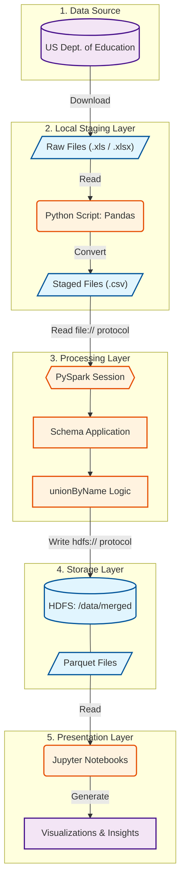

# System Architecture Document
## Big Data Computing - Group Project

**Team Number:** 7  
**Project Title:** Crime on College Campuses  
**Date:** 24 NOV 2025      

---

## Executive Summary

Our system is built to collect, analyze, and study criminal data metrics collected in United States university environments in order to determine patterns of crime. Data was proved by the Department of Education in .xls format.

One of our primary technical challenges was storing data using HDFS. HDFS proved quite tricky to install and set up. Furthermore, deciding how to store provided files (in their native xls format, csv, or parquet styles) proved to be another challenge. 

We elected to simulate a fully fledged HDFS on a local host, process excel files into CSVs using Pandas, and then store them on HDFS. All of the files were converted succesfully.

Our final analysis will be conducted using Jupyter.

---

## 1. System Architecture Overview

### 1.1 Architecture Diagram


Include:
- Data sources
- Ingestion layer
- Processing layer
- Storage layer
- Presentation layer
- All technologies used at each layer
- Data flow directions

Data Sources → XLS/XLSX (Department of Education), CSV

Ingestion Layer → Direct File Upload

Processing Layer → Spark (PySpark)

Storage Layer → HDFS

Presentation Layer → Jupyter


**Diagram Tools:** Use draw.io, Lucidchart, or similar. Export as PNG/PDF.

### 1.2 Architecture Pattern

**Pattern Used:** Batch Processing

**Justification:**

We chose a batch processing architectural pattern to achieve maximum efficiency. Our knowledge with relations, Spark, HDFS, and Jupyter mesh well with a batch architecture, and in our case, the benefits include cheap storage and scalability. 

The provided DoE data isalso historical, static, and batch produced. Streaming our data is not feasible or supported by the DoE.

---

## 2. Detailed Component Design

### 2.1 Data Ingestion Layer

**Purpose:** 

The purpose of the Data Ingestion Layer is to collect and cleanse the data from the Department of Education, before preparing them for distributed processing.

**Technologies:** Direct File Upload, Pandas

**Implementation Details:**
- **Data Source:** Department of Education
- **Ingestion Method:** Batch
- **Data Format:** XLS → CSV
- **Frequency:** Real-time
- **Volume:** Records/second

**Code Snippet:**
```python
for excel_path in input_dir.glob("*.xls*"):
    print(f"Converting {excel_path.name}...")

    df = pd.read_excel(excel_path)

    csv_name = excel_path.stem + ".csv"
    csv_path = output_dir / csv_name
    
    df.to_csv(csv_path, index=False)
```

**Challenges & Solutions:**
Altering the xls format to csv was a simple challenge. The number of xls files dwarfed this problem however, working with each file individually became tedious. Further optimization techniques would be required to scale this ecosystem.

---

### 2.2 Data Storage Layer

**Purpose:** 

The Data Storage Layer stores data for use. HDFS specifically stores large files by distributing their contents over multiple nodes in our cluster. Given our constraints, we opted for an HDFS local host.

**Technologies:** HDFS

**Data Organization:**
- **Storage Format:** Parquet
- **Partitioning Strategy:** By Crime type
- **Estimated Size:** 135.1 MB

**Schema Design:**
We have a number of different schemas for different kinds of crime. All schema's share the following fields:

institution_fields = [
    StructField("UNITID_P", LongType(), True),
    StructField("INSTNM", StringType(), True),
    StructField("OPEID", StringType(), True),
    StructField("BRANCH", StringType(), True),
    StructField("Address", StringType(), True),
    StructField("City", StringType(), True),
    StructField("State", StringType(), True),
    StructField("ZIP", StringType(), True),
    StructField("sector_cd", IntegerType(), True),
    StructField("Sector_desc", StringType(), True),
    StructField("men_total", IntegerType(), True),
    StructField("women_total", IntegerType(), True),
    StructField("Total", IntegerType(), True),
]

while each schema type has specific types of crime field data. For example, our Violence Against Women Act schema details (in text fields) specific kinds of violent perpetrations, while our crime schema details broader categories of criminal activity.

**Optimization Techniques:**
- File Type: We chose to store our data in a parquet data format. This columnized storage type allow PySpark to minimize useless computations.
- Schema on Read: We saved our data with as few edits as possible. We wish to retain as much 'schema on read' benefit as possible and utilize HDFS and parquet file type as much as possible.

---

### 2.3 Data Processing Layer

**Purpose:** 

The purpose of the Data Processing Layer is to transform the data into a clean, usable version that can be used for analysis and visualization.

**Technologies:** Spark (PySpark)

**Processing Pipeline:**

```
Stage 2: Transformation (Excel --> CSV, CSV --> Parquet)
    ↓
Stage 3: Aggregation/Analysis
    ↓
Stage 4: Results Storage
```

**Key Transformations:**
1. **[Transformation 1]:** 30 Excel files to 30 CSV files
   - Input: 30 Excel
   - Output: 30 CSV

2. **[Transformation 2]:** 30 CSV to 4 Parquet
   - Input: 30 CSV
   - Output: 4 Parquet

**Code Snippet:**

```python
# Merging dataframes with different column sets (Years)
vawa = reportedvawa181920_df \
    .unionByName(reportedvawa212223_df, allowMissingColumns=True) \
    .unionByName(oncampusvawa181920_df, allowMissingColumns=True) \
    # ... unions continue ...

# Writing to HDFS
vawa.write.mode("overwrite").parquet("hdfs://localhost:9000/data/merged/vawa.parquet")

```

### 2.5 Visualization/Presentation Layer

**Purpose:** 

The purpose of the Visualization/Presentation Layer is to transform and display the data to be easily readable and understandable using graphs, charts, and other visualization methods.

**Technologies:** Jupyter

**Visualization Types:**
- [Viz 1]: Heat map of the United States (more opaque at crime hotspots)
- [Viz 2]: Bar chart displaying highest top 20 crime rates by institution
- [Viz 3]: Bar chart displaying lowest top 20 crime rates by institution

---

## 3. Technology Stack Justification

| Technology | Purpose | Why Chosen | Alternatives Considered |
|------------|---------|------------|------------------------|
| Apache Spark | Data processing | High performance, in-memory computing | Hadoop MapReduce (too slow) |
| Jupyter | NoSQL storage | Iterative, integrated environment, Matplotlib | Tableau |

---

## 4. Scalability Analysis

### 4.1 Current Scale
- **Data Volume:** 135.1 MB
- **Processing Time:** ~ 1 minute
- **Cluster Configuration:** Memory

We implemented a test python file to check read, write, and storage capabilities on HDFS. We feel confident that if given more computing resources, scaling that aspect of our process wouldn't be difficult.

The greatest scaling challenge lies in batch processing a ridiculously large amount of xls files. If this were able to be done at scale, the rest of our system would scale handely.
---

## 5. Implementation Status

### 5.1 Completed Components
- [x] Data ingestion pipeline
- [x] Basic Spark processing
- [x] Storage layer setup
- [ ] Visualization dashboard (not started)

### 5.2 Code Repository

**Repository URL:** (https://github.com/ROMpom15/md-crime)

**Directory Structure:**
```
md-crime/
├── archive/           # Old files
├── src/
│   ├── hdfs_env/      # Environment scripts
│   ├── preproc/       # ETL scripts (loadschemas.py, dataconversion.py)
├── data/
│   ├── datasets_csv/  # Staging area
│   └── raw/           # Original DoE downloads
├── notebooks/         # Jupyter analysis notebooks
└── reports/           # Markdown documentation


```
---

## 6. Demonstration Plan

### 6.1 Live Demo Flow 

Our group is going to demonstrate what it looks like to load our data into HDFS then run the code reading from HDFS. From there, we will generate a graphic. 

### 6.2 Backup Plan

If the live demo fails, we will produce a video recording of a successful attempt.

---

### 6.3 Timeline for Final Week (04DEC)

**Day 1-2:** Have everything loaded in by 25NOV. By 01DEC, have working queries and quality analysis. 

**Day 3-4:** By 02DEC, we will complete all visualizations. By 03DEC, add finishing touches and complete Jupyter notebook.

---

## 7. Lessons Learned So Far

### 7.1 Technical Insights
- **What worked well:** [e.g., Using Parquet significantly reduced storage]
- **What was challenging:** [e.g., Debugging distributed shuffle operations]
- **Key learning:** [e.g., Importance of partitioning strategy]

### 7.2 Team Process
- **Effective practices:** [e.g., Daily standups kept everyone aligned]
- **Improvements needed:** [e.g., Earlier integration testing]

---

## 8. References

1. Gemini 3, Thinking Model
2. Stack Overflow
3. GeeksForGeeks

---

**Submit by: Tuesday 25NOV25 @ 0730**
